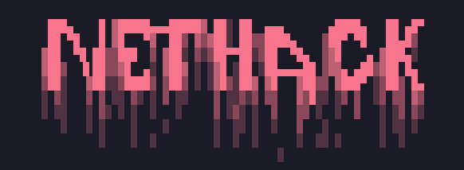

# NetHack 


NetHack es un conjunto de scripts en Bash diseñados para automatizar y facilitar el proceso de auditoría de seguridad en redes inalámbricas. Esta herramienta integra funcionalidades clave para pruebas de penetración, desde la captura de handshakes hasta ataques de fuerza bruta y despliegue de puntos de acceso falsos (Evil Twin), centralizando el flujo de trabajo en una interfaz de consola unificada.


<p align="center">


  


</p>


## Características Principales


El script principal gestiona un flujo de trabajo modular que incluye:


* **Gestión de Dependencias:** Instalación automatizada de paquetes necesarios mediante detección de distribución.


* **Captura de Handshake:** Automatización del modo monitor, escaneo de redes (airodump-ng) y ataques de desautenticación (aireplay-ng) para forzar y capturar el 4-way handshake.


* **Ataques de Diccionario:** Integración directa con Aircrack-ng para comprobación de claves basada en listas de palabras.


* **Fuerza Bruta Avanzada:** Implementación de Hashcat para ataques exhaustivos, permitiendo la selección de hardware (CPU, GPU, FPGA) y perfiles de carga de trabajo optimizados.


* **Evil Twin + Deauth:** Despliegue automatizado de ataques de punto de acceso falso utilizando Eaphammer junto con ataques de desautenticación continuos (dirigidos o broadcast).


## Compatibilidad


Este proyecto ha sido probado y diseñado para funcionar en las siguientes distribuciones de Linux:


* Kali Linux


* Arch Linux


* BlackArch


## Requisitos Previos


Para el correcto funcionamiento de la suite, se requiere:


1. **Hardware:** Tarjeta de red inalámbrica compatible con el modo monitor e inyección de paquetes.


2. **Permisos:** Acceso de superusuario (root) o capacidad para ejecutar comandos con `sudo`.


3. **Dependencias de Software:**


    * Aircrack-ng Suite


    * Hashcat


    * Hcxtools (hcxpcapngtool)


    * Eaphammer


    * Kitty (Emulador de terminal requerido para ventanas externas)


*Nota: El script incluye un módulo de instalación para dependencias básicas, pero herramientas avanzadas como Eaphammer pueden requerir configuración manual previa dependiendo de su entorno.*


## Instalación


Clone el repositorio en su máquina local y otorgue permisos de ejecución a los scripts:


```bash


git clone https://github.com/whoamijas0n/nethack.git


cd nethack


chmod +x nethack.sh scripts/*.sh


```


## Uso


Para iniciar la herramienta, ejecute el script principal desde el directorio raíz del proyecto:


```bash


sudo bash nethack.sh


```


## Menú Principal


Al iniciar, se presentará un menú interactivo con las siguientes opciones:


* **Instalar dependencias:** Detecta su gestor de paquetes (apt o pacman) e instala las herramientas base necesarias. Ejecute esto primero si es su primera vez utilizando la herramienta.


* **Captura de handshake:** Guía el proceso de selección de interfaz, habilitación de modo monitor, escaneo de objetivos y captura de tráfico.


* **Ataque de diccionario:** Utiliza un archivo .cap capturado previamente para intentar recuperar la contraseña mediante listas de palabras.


* **Ataque de fuerza bruta (Hashcat):** Convierte capturas al formato HC22000 y permite configurar ataques complejos seleccionando juegos de caracteres y potencia de hardware.


* **Ataque Evil Twin:** Configura un punto de acceso fraudulento para interceptar credenciales, gestionando simultáneamente la desconexión de clientes del punto de acceso legítimo.


## Advertencia


Esta herramienta ha sido desarrollada con fines exclusivamente educativos y de auditoría ética profesional. El uso de este software para atacar objetivos sin consentimiento previo y explícito es ilegal. El desarrollador no se hace responsable por el mal uso que se le pueda dar a esta herramienta ni por los daños causados. Es responsabilidad del usuario final cumplir con todas las leyes locales, estatales y federales aplicables.


## Licencia y Autor


Este proyecto ha sido creado por **Jason Caballero (whoamijas0n)**.


Distribuido bajo la licencia **GNU General Public License v3.0**.  


Consulta el archivo `LICENSE` para más detalles.
